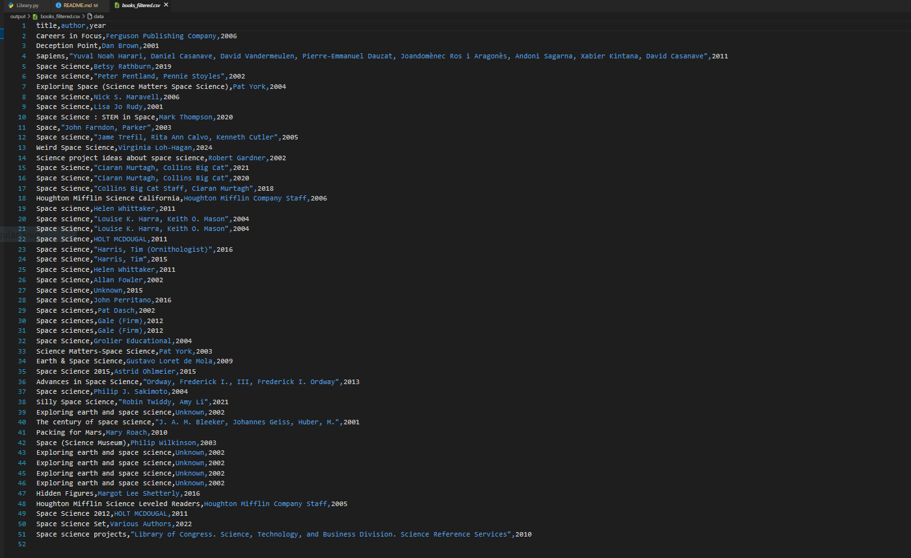

# Library-System-Project
***# پروژه سیستم کتابخانه***

***این پروژه با استفاده از*** **OpenLibrary API** ***طراحی شده است.***  
***هدف پروژه این است که اطلاعات مربوط به حدود ۵۰ کتاب را از API دریافت کرده و در قالب فایل خروجی (CSV یا TXT) ارائه دهد.***  

***این پروژه می‌تواند برای نمونه‌سازی سیستم‌های مدیریت کتابخانه، تمرین کار با API و پردازش داده‌های متنی مورد استفاده قرار گیرد.***

***## فایل خروجی نمونه***

***می‌توانیدعکس های گرفته شده از خروجی را از لینک زیر مشاهده یا دانلود کنید:***

[دانلود عکس اول که از خروجی گرفته شده](output1.PNG)

***همچنین شما میتوانید برای اطلاعات بیشتر از این پروژه فایل  کتابخانه را دانلود کنید ***

[کتابخانه]([text](
))